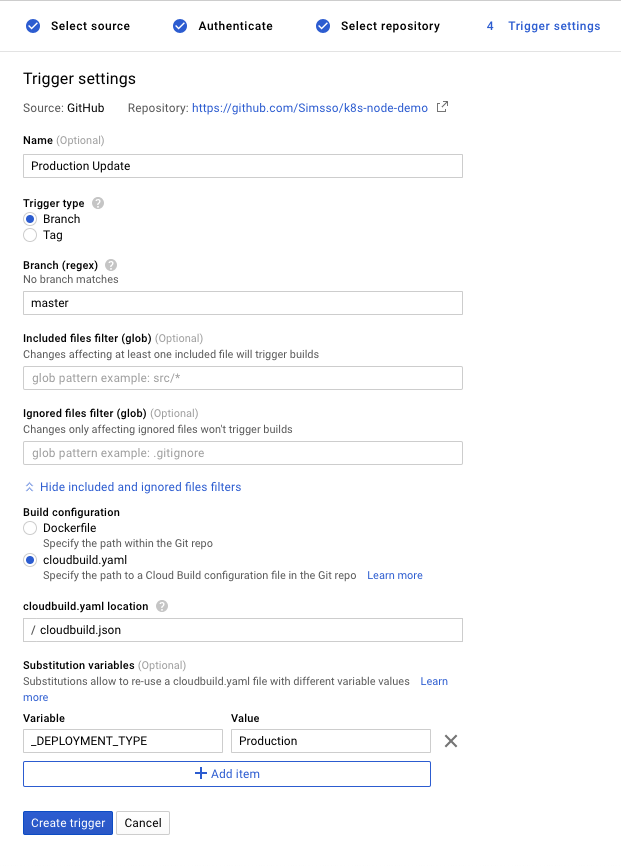
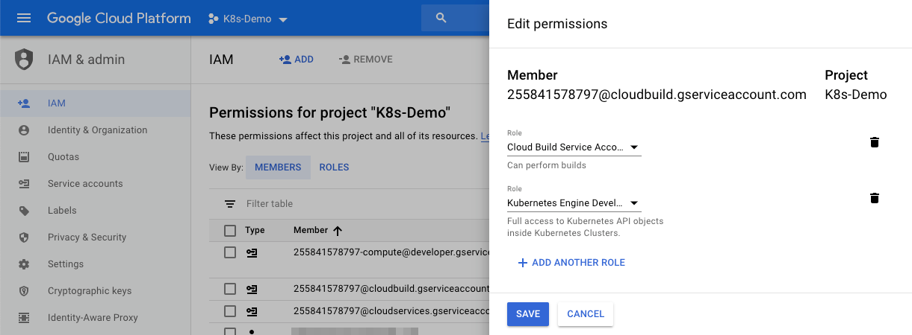
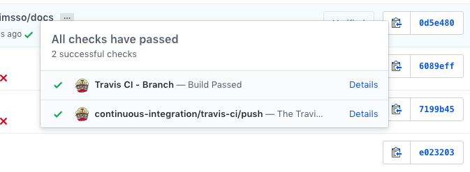

# K8s Demo Application

This is the project used for testing a CI/CD setup which deploys a Node.js application to a Kubernetes cluster, triggered by commits to the repository's master branch. The pipeline also runs all unit tests and allows PRs only to be merged if all of them pass.

The following steps are not a tutorial but rather some notes I took while setting things up.

## Steps
0. Create a GitHub repository
1. Write protect `master` branch (work is done in feature branches with PRs)
2. Create a simple Node.js application that has an HTTP endpoint (here `GET :80/`)
3. Add unit tests
4. ~~Add [Google Cloud Build](https://github.com/apps/google-cloud-build) to the GitHub repository~~
5. Create a build trigger [in CGP](https://console.cloud.google.com/cloud-build/triggers) for "Production Update" (screenshot 1) and "Unit Tests"
6. Create the `cloudbuild.json` file and add `npm install` and `npm test` steps
7. ~~Every commit and every PR should be checked (screenshot 2 and 3)~~
8. Dockerize the application
9. Create a K8s cluster (e.g. in the GCP Kubernetes Engine)
10. Connect with `kubectl` (get the content for `~/.kube/config` file with `gcloud container clusters get-credentials $NAME --zone $ZONE > ~/.kube/config`); `kubectl cluster-info` shows the IP addresses
11. Start a proxy `kubectl proxy`
12. Connect to the dashboard at `http://localhost:8000/api/v1/namespaces/kube-system/services/https:kubernetes-dashboard:/proxy/` with the token from the `config` file
13. Add docker build and push steps to the `cloudbuild.json` file (in this repository split into two files)
14. Add K8s roles to the cloudbuild user (screenshot 2)
15. Push helm Docker image to the GCR [reference](https://github.com/GoogleCloudPlatform/cloud-builders-community/tree/master/helm)
16. Install Tiller on the cluster (install helm locally, run `helm init`)
    > Tiller (the Helm server-side component) has been installed into your Kubernetes Cluster.
    
    Should add a pod to the list output by `kubectl get po --namespace=kube-system`
17. Give tiller permissions to create stuff (following [this comment](https://github.com/fnproject/fn-helm/issues/21#issuecomment-414210748))
18. Add helm step to the pipeline
19. Setup TravisCI; every commit and every PR should be checked (screenshot 3)

### Screenshots
_Screenshot 1: Setting up a build trigger on GCP._  

_Screenshot 2: Adding the required roles to the cloud build user on GCP._  

_Screenshot 3: Travis CI runs unit tests for every commit and every PR. They are being shown in the GitHub repository very nicely._  

